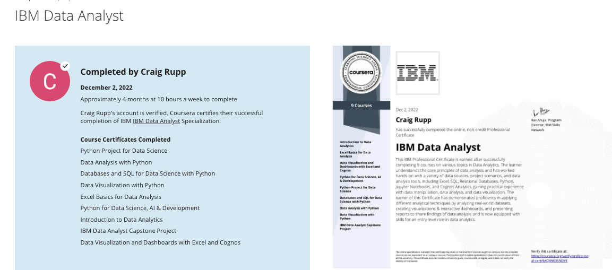
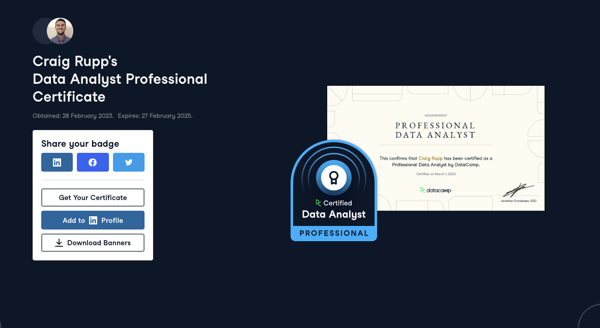

# 💹 Data Analysis & Modeling Repository Overview 💹
Within this repository is a collection of materials used in completing capstone projects and accredited certification in Data Analysis. 

## Data Analysis, Visualization, Modeling & Dashboard Generation

### **Project Details & Certificate Issuers**
#### `IBM`

IBM has a comprehensive learning path available through Coursera with a culminating capstone project which will be linked to below. Throughout the program, the curriculum offers labs, tests, exercises and ultimately the capstone project to bring together skills and tools that represent the most up-to-date practical skills and tools that data analysts use in their daily roles. Such ares of focus included
* Spreadsheets, Microsoft Excel
* Python Programming, Pandas, Numpy, Matplotlib
* SQL, Dashboard and BI Tools such as IBM Cognos Analytics
* Presentation Generation for Business Metrics and Stakeholder Presentation

`Capstone : IBM`
* https://dataplatform.cloud.ibm.com/dashboards/61d7561d-fb2d-4820-acd8-f05119dffc19/view/7c18ea2c0f9539e976d3b1e407cc2d502930215ae7bbd20ad6847b490f607097f06b1092c82f1e0fd2430665f6ee125ec0
  - Dashboard
  - (Please allow a little time for loading)
* https://github.com/craigtrupp/data_analysis_projects/tree/main/IBM_DataAnalysis_Capstone
  - Section Details will be introduced in project markdown
* https://github.com/craigtrupp/data_analysis_projects/blob/main/IBM_DataAnalysis_Capstone/Capston_Presentation_Slides.pdf
  - Accompanying report for data analysis performed

`Additional Section Learning Material`
* Course details and logged materials highlighting the learning path for the course can be found as well 
  - https://github.com/craigtrupp/Online_Data_Python/tree/main/Coursera/DataAnalyst_Cert

---

 

#### `DataCamp`

DataCamp offers various levels of certification for users of the platform to have their technical and reporting accumen put to the test to prove your skills are job-ready with **Associate** and **Professional** level certifications.  DataCamp's coding challenges are free form, where candidates are presented with certain data but it is up to them to come up with an appropriate solution. The goal of this task is to demonstrate that the individual has the ability to perform the tasks required of them as a data analyst or scientist without being guided towards the appropriate solution.

`Coding Challenges`
* Data Analyst Professional
  - Coding Challenge : https://github.com/craigtrupp/data_analysis_projects/blob/main/DataCamp_Certificate_Projects/DataAnalysis_Cert/DAnalyst_Professional_ProductSales.ipynb
  - Report : https://github.com/craigtrupp/data_analysis_projects/blob/main/DataCamp_Certificate_Projects/DataAnalysis_Cert/Pens%20%26%20Printers%20Customer%20Sales%20Analysis.pdf

* Data Science Professional
  - Coding Challenge : https://github.com/craigtrupp/data_analysis_projects/blob/main/DataCamp_Certificate_Projects/DataScience_Cert/Recipe_Classifier_DScienceProfessionalProject.ipynb
  - Sample Business Request : https://github.com/craigtrupp/data_analysis_projects/blob/main/DataCamp_Certificate_Projects/DataScience_Cert/RecipeClassifier_BusinessRequest.pdf

The root folder containing details for each project submission and accompanying material can be found at 
  - https://github.com/craigtrupp/data_analysis_projects/tree/main/DataCamp_Certificate_Projects

For Further Details on DataCamp's Certification Process
* https://app.datacamp.com/certification/resource-center/faq
* https://www.datacamp.com/blog/certificates-or-certification-which-should-you-choose

---

 

### `Projects: Areas of Focus`

The capstone and challenges completed referenced such areas as

* Product Sales Analysis
* Most Advantageous Sales Method Types
* Revenue Distribution
  - Revenue Distirubtion by Sales Methods
  - Revenue Distribution Overall Time Intervals
* Binning Customer Activities by Categorical Features
* Location Proportional Sales Revenue & Distribution
* Key Business Metric Identification
* Predictive Website Traffic Analysis
* Principal Component Analysis
* Varying Model Accurary for Predictive Accuracy
* Dashboard Generation
* Data Wrangling
* And more!

